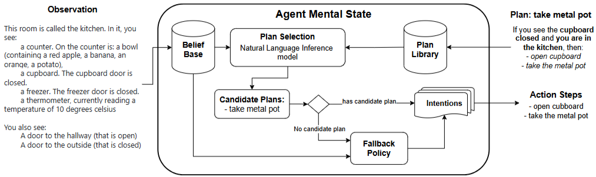

# BDI Agents in Natural Language Environments

1. 인간 활동 관찰로 얻는 비정형 데이터를 자연어로 작성된 에이전트의 신념(Belief)으로 기술하고 에이전트의 자연어 계획 라이브러리를 생성

2. 자연어 정보를 추론 백엔드에서 사용하는 BDI 멘탈 모델을 따르는 에이전트 인터프리터를 개발한다. 자연어 추론을 사용하여 계획 선택 중에 신념 기반과 계획 라이브러리의 계획 컨텍스트 간의 힘의 관계를 찾는다.

3. 계획 선택 메커니즘이 후보(즉, 적용 가능한) 계획을 찾지 못하는 경우 에이전트가 자율적으로 행동하도록 돕기 위해 블랙박스 강화 학습 아키텍처를 사용하는 fallback 정책에 의존한다.

---
# 용어 설명

## Belief(신념)
Belief는 에이전트의 인식에 따른 환경에 대한 정보를 나타내며, 이는 현재 상태를 설명한다. 에이전트 실행 중에 에이전트는 환경에서 이벤트를 관찰하고 신념 기반 데이터구조에 새로운 신념을 포함하거나 기존 신념을 업데이트 할 수 있다.

## Desire(욕망)
Desire는 에이전트가 설계 목표를 충족하기 위해 달성하고자 하는 상황을 나타낸다.

## Intention(의도)
Intention은 Desire의 특정 하위 집합을 달성하기 위한 에이전트의 약속을 나타내며, 컴퓨팅 능력에 물리적 한계가 있는 에이전트가 내리는 실질적인 의사 결정을 설명하기 위해 에이전트의 추론을 위한 필터 역할을 한다. 즉, 제한된 두뇌 능력을 가진 실제 인간이 어떻게 결정을 내리는지에 대한 구체적인 설명일 뿐만 아니라 물리적 컴퓨터의 한계 내에서 실행되는 계산 에이전트를 설계하기 위한 전체적인 청사진 역할도 한다.

Intention 구성 요소는 종종 Desire의 하위 집합을 달성하기 위해 에이전트가 채택한 인스턴스화된 계획 세트로 구성된 구조이다. 이러한 계획은 에이전트가 특정 욕망을 달성하기 위해 실행되는 일련의 단계이다. 대부분의 실용적인 에이전트 아키텍처는 에이전트가 사용할 수 있는 전체 계획 또는 에이전트가 런타임 중에 계획을 생성할 수 있도록 하는 계획 규칙을 포함하는 계획 라이브러리를 사용한다.

BDI 모델은 에이전트 지향 프로그래밍 패러다임에서 규칙 기반 자율 에이전트를 구현하는 데 가장 널리 사용되는 모델이라고 할 수 있다.

---

# NatBDI
NatBDI 작동의 핵심은 설계자가 NatBDI의 계획 라이브러리를 위해 자연어로 계획을 작성하는 방식이며, 계획 라이브러리가 적용 가능한 계획을 제공하지 못할 때 에이전트가 계획을 선택할 수 있도록 하는 fallback 메커니즘을 수행한다.

논문에서는 BDI 이벤트 기반 접근 방식을 활용하여 다음과 같은 단계로 구성된 에이전트 추론 주기를 개발한다.

## 추론 주기

1. 에이전트는 목표 추가 이벤트와 유사한 주요 목표를 나타내는 작업 설명을 받는다.

2. 에이전트는 수신된 목표를 트리거 이벤트로 갖는 계획을 계획 라이브러리에서 검색하고 현재 신념(Belief) 기반이 계획 컨텍스트를 수반하는지 여부를 비교한다.
   - 이 단계에서 에이전트는 현재 신념 기반을 기반으로 계획 옵션을 계획 라이브러리에서 검색한다. 에이전트가 선택한 계획이 주어지면 인터프리터는 계획 본문에 포함된 단계를 분석하며, 이는 또 다른 목표 ㅊ푸가 이벤트 또는 실행될 작업일 수 있다.
   - 사용 가능한 후보 계획이 없거나 에이전트가 주요 목표를 달성하지 못한 경우 추론 주기는 분해 프로세스에서 실패를 생성한다.

3. 알고리즘 1의 끝에서 이러한 실행이 주요 추론 주기에 실패를 반환하면 에이전트는 fallback 계획을 사용하여 실패를 처리하려고 시도한다.

## Belief(신념) 기반
자연어 신념 기반을 나타내는 접근 방식은 전통적인 BDI 모델을 따르며, 이는 인식된 정보를 정신 모델의 리터럴로 구성한다. 신념 기반은 자연어의 간단한 문장으로 구성되어 있으므로 인간은 에이전트의 정신 상태를 면밀히 조사하고 에이전트의 행동을 이해하는 데 도움이 된다.

본 연구에서는 현재 환경 상태에 대한 관찰을 설명하는 자연어 문장 목록으로 신념 기반을 유지한다. 관찰은 자연어로 설명된 환경으로부터의 인식으로 구성된다.
특히, 우리의 접근 방식은 **전체 텍스트 관찰을 개별 구문으로 분할하여 각 문장을 신념 기반에 추가될 특정 신념과 연결한다.** 이러한 문장은 이전 작업에서 인식된 환경 효과, 에이전트가 현재 위치에서 본 객체, 에이전트의 인벤토리에 있는 항목을 설명한다. 예를 들어 하단의 그림에서 설명된 텍스트 관찰은 환경의 현재 상태에 대한 여러 사실을 알려주는 단락이다.

에이전트는 텍스트를 문장 목록으로 분할하여 각 문장을 단일 신념으로 나타낸다. 따라서 "You see a freezer"와 "You see a thermomether"는 두 개의 서로 다른 신념을 나타낸다. 에이전트가 신념 기반에서 신념 추가 또는 삭제를 확인하는 기존 BDI 방식과 달리, 이 에이젙느는 작업을 수행한 후 인식된 새로운 텍스트 정보로 이전 신념 기반 상태를 간단히 다시 작성한다. 신념 기반 무결성은 텍스트 환경이 수행된 작업의 효과를 나타내는 방식에 달려있다. 이 에이전트는 **작업 효과로 인한 불일치를 피하기 위해 인식된 이전 신념을 덮어쓰는 방식으로 신념 기반을 업데이트한다.**

## Natural Language Plan Library
이 에이전트 아키텍처는 에이전트 개발자가 자연어를사용하여 계획 규칙을 인코딩할 수 있도록 자연어 인터페이스에 의존한다. 이 연구에서는 자연어 계획을 명확하게 기술된 조건과 신념을 포함하는 제어 자연어로 표현한다.

제어 자연어는 자동 처리에 더 적합한 자연어의 하위 집합이며, 이를 통해 계획 규칙의 구조 내에서 제한 없는 자연어를 섞어 사용할 수 있다. 제어 자연어 계획을 기호 표현(즉, prolog)로 변환하는 접근 방식과는 대조적으로, 이 아키텍처는 계획 선택 중에 자연어 계획 규칙에 대해 직접 추론한다.

NatBDI는 정의에서 제어 자연어를 사용하지만, 이 연구에서는 AgentSpeak 계획 규칙과 유사한 구조를 따르는 것으로 해석한다. 따라서 각 계획 규칙은 의도된 목표에 대한 설명, 계획 컨텍스트에 대한 설명, 그리고 계획 본문을 정의하는 문장 집합으로 구성된다.

목표는 에이전트가 수행하려는 작업을 설명하는 문장이다. 계획 컨텍스트는 해당 문장 간의 논리적 연결을 나타내기 위해 "AND"라는 단어로 연결된 자연어 문장 집합으로 구성된다. 보다 공식적으로, 이 제어 자연어 계획은 Listing 1의 템플릿을 따른다.
> Listing 1: NatBDI 제어 자연어로 작성된 계획의 템플릿.
>
> IF **\<<i>goalstatement\></i>** 
> CONSIDERING **\<<i>plancontextstatements\></i>** 
> THEN: 
> **\<<i>planbody\></i>**

계층적 계획을 수용하기 위해 에이전트 인터프리터는 계획 본문에서 액션 또는 하위 목표를 나타내는 문장을 수용한다. 여기서 하위 목표는  AgentSpeak의 목표 추가 이벤트와 유사하게 작동한다. 계획 본문 섹션에서 목표 추가 이벤트를 나타내는 "PLAN TO" 키워드를 포함하여 목표 추가를 인코딩하는 문장과 액션을 설명하는 문장을 구별한다. AgentSpeak에서와 마찬가지로 에이전트는 스택 데이터 구조에서 하위 목표를 추적한다. 에이전트가 새로운 목표를 채택하면 스텍에 쌓이고, 목표를 달성하면 스택에서 제거된다. 이러한 키워드는 에이전트 인터프리터가 환경으로 전송되는 액션과 재귀적 하위 목표에 대한 내부 추론을 구별하는 데 도움이 된다. 액션은 에이전트가 환경에서 수행해야 하는 작업을 설명하는 명령문으로 구성된다.

예를 들어, Listing 2에 설명된 자연어 계획은 사람이 특정 작업을 달성하도록 에이전트에 명시적으로 지시하는 방법을 보여준다. 첫 번째 계획에서 사람은 금속 컵이 처음에 닫혀 있는 찬장에 있다는 것을 알고 있으며 자연어 계획을 사용하여 금속 컵을 얻는 방법에 대해 에이전트에 지시한다. 트리거링 이벤트는 "get the metal pot" 목표이며, 계획의 컨텍스트가 참인 경우, 즉 에이전트가 부엌에 있고 닫힌 찬장을 보고 있는 경우 계획 후보로 간주되어야 한다. 계획 본문은 텍스트 환경에서 해석될 자연어 지침으로 작성된 ㄱ두 가지 액션으로 구성된다. 먼저 에이전트는 찬장을 열고 금속 냄비를 가져와야 한다. 두 번째 계획은 목표가 물을 녹이는 것일 때 트리거된다. 이는 하위 목표(get the metal pot)가 필요한 계획의 일부를 보여준다.
>**Listing 2: ScienceWorld에서 금속 냄비를 선택하고 물을 녹이는 자연어 계획.**
>
>**IF** tour task is get the metal pot
>**CONSIDERING** you are in the kitchen
>   AND you see the cupboard closed
>**THEN:**
> open the cupboard,
> take the metal pot
>
>**IF** your task is to melt water
>**THEN:**
>**PLAN TO** get the metal pot
> pick up thermometer
>...

## Entailment with Natural Language Beliefs(자연어 신념을 통한 수반)
BDI 아키텍처의 대부분 구현은 에이전트의 신념 기반에 의해 수반될 때 계획 채택을 트리거하는 컨텍스트 조건을 기반으로 계획을 선택한다. 이는 에이전트가 나중에 실행할 옵션에 대한 필터를 만든다. 구체적으로, 신념 기반이 계획에 설명된 조건을 논리적으로 수반하는 경우 에이전트는 의도 구조 내에서 해당 단계를 실행하기로 약속한다. 에이전트가 자연어 정보를 처리하므로 자연어 내에서 함의(내포된 뜻)를 계산하는 것이 중요한 과제가 된다. 이 연구에서는 자연어 정보에 대한 함의 연산을 에뮬레이션하기 위해 머신러닝으로 학습된 NLI(Natural Language Inference) 모델을 활용한다.

BDI 모델에서 계획 선택 메커니즘은 함의 추론은 계획이 후보인지/적용 가능한지 여부를 나타내는 Boolean 값으로 구성된다 가정한다. 최근에는 세 가지 논리적 관계(함의, 모순, 중립)를 생성하는 삼방향 분류 방법으로 자연어 추론 모델을 개발한다. 이 연구의 주요 목표는 신념 특정 계획 컨텍스트를 수반하는지 여부를 추론하는 것이므로 모순 및 중립 클래스를 비-함의 관계로 통합한다. 따라서 폐쇄 세계 가정 하에서 자연어 추론 모델을 이진 분류기(즉, Boolean 신호 반환)로 사용한다.

실제로 신념 기반이 계획 컨텍스트를 수반하는지 여부를 추론하려면 계획 컨텍스트의 각 문장에 이를 수반하는 신념이 하나 이상 있는지 비교해야 한다. 특히 에이전트는 해당 계획을 선택해야 하는지 결정하기 위해 신념 기반의 모든 신념을 모든 계획 컨텍스트와 비교해야 한다. 신념과 계획 컨텍스트는 여러 문장으로 구성되므로 NatBDI는 두 문장 집합 간의 데카르트 곱을 생성하여 이 두 구조 간의 함의 추론을 처리한다. 공식적으로 신념 기반 B와 C를 각각 나타내는 두 문장 집합이 주어지면 방정식 1에서 C x B로 표시되는 행렬을 만든다. C x B에 포함된 각 신념 b ∈ B 및 계획 컨텍스트 c ∈ C 썽애 대해 방정식 2에서 **<i>nli</i>** 함수로 표시되는 자연어 추론을 사용하여 Boolean 행렬 $E_{i,j}$를 생성한다. 행렬 $E_{i,j}$는 각 i번째 계획 컨텍스트와 j번째 신념에 대한 모든 추론 결과를 포함한다.

>
>방정식 1 $$M_{i,j} = \text{C} \times \text{B} = \{(c_i, b_j) \mid c \in \text>{C} \land b \in \text{B}\}$$

>방정식 2 $$E_{i,j} = \{nli(c_i, b_j) \mid (c_i, b_j) \in M_{i,j}\}$$

에이전트가 선택할 후보 계획인지 확인하기 위해 모든 j번째 신념을 사용하여 각 i번째 컨텍스트에 대해 $E_{i,j}$의 Boolean 값으로 주어진 논리합을 적용한다. 논리합에 의해 생성된 각 Boolean이 주어지면 각 c에 대해 논리곱을 적용하여 단일 Boolean 값을 생성한다. 따라서 방정식 3에서와 같이 NatBDI에서 신념 기반으로부터의 계획 컨텍스트의 함의를 정의한다.

>방정식3 $$
>\mathbf{B} \models \mathbf{C} \triangleq \bigwedge_{c_i \in C} \bigvee_{b_j \in B}
>$$

예를 들어 "이 방은 부엌이라고 합니다." 및 "찬장이 보이고 찬장 문이 닫혀 있습니다."라는 문장이 포함된 신념 기반이 있는 상태를 고려하십시오. 이러한 신념 기반과 "당신은 부엌에 있습니다." 및 "닫힌 찬장이 보입니다."라는 문장으로 구성된 컨텍스트가 있는 계획 간의 추론은 다음과 같이 작동한다.

먼저 컨텍스트 문장을 나타내는 i번째 행과 신념 문장을 나타내는 j번째 열을 사용하여 행렬 $E_{i,j}$의 값을 다음과 같이 계산한다.
$\begin{bmatrix} T & F \\ F & T \end{bmatrix}$
"이 방은 부엌이라고 합니다."라는 신념은 "당신은 부엌에 있습니다."라는 컨텍스트를 수반하고 "찬장이 보이고 찬장 문이 닫혀 있습니다."는 "닫힌 찬장이 보입니다."를 수반한다. 각 컨텍스트가 있는 모든 신념 간의 첫 번째 논리합 연산은 다음 행렬을 생성한다. 
$\begin{bmatrix} T \\ T \end{bmatrix}$
결과적으로 논리곱 연산은 스칼라 Boolean $\begin{bmatrix} T \end{bmatrix}$를 생성한다. 이는 함의 추론의 최종 결과이므로 신념 기반의 정보가 계획 컨텍스트를 수반한다고 결론 내릴 수 있다. 결과적으로 이것은 후보 계획이 된다.

## fallback 정책
학습 문제로서의 BDI 계획 선택을 다루는 이전 연구에서는 컨텍스트 조건 학습과 부분적 관찰 가능한 마르코프 결정 프로세스(Partially Observable
Markov Decision Process, POMDP)에서 상호작용하는 에이전트로서의 BDI 에이전트 모델링이 포함된다. POMDP는 에이전트가 관찰을 통해 간접적으로 상태를 인식하는 확률적 환경의 모델이다. POMDP 에이전트는 상태를 신념 상태 집합에 저장하고 BDI 에이전트는 동일한 역할을 위해 신념 기반 구성 요소를 사용하므로 두 모델 모두 에이전트 상태를 나타내기 위해 신념 개념을 사용한다. 이러한 연구는 계획을 선택하고 실행하는 BDI 절차를 POMDP 상태 추정기로 구현할 수 있음을 보여준다. 이러한 대응 관계가 주어지면 자연어 추론이 후보를 생성하지 못하는 경우(즉, 계획 라이브러리에 후보 계획이 없는 경우) 강화 학습으로 학습된 계획 선택 메커니즘을 통합하여 계획을 생성한다.

계획 라이브러리에 사용하는 계획-규칙 형식과 일관된 계획을 생성하기 위해 각 가능한 컨텍스트에 대해 단일 작업으로 구성된 계획 본문을 생성할 수 있는 fallback 정책을 학습한다. 따라서 각 턴에서 에이전트는 사람이 정의한 계획-규칙의 단계를 실행하거나 fallback 정책의 작업을 실행한다. fallback 정책에는 학습 제한으로 인해 비효율적인 계획이 포함될 수 있으므로 에이전트가 동일한 이벤트에 대해 동일한 계획으로 응답하는 횟수를 추적하며, 이는 I파라미터로 제어한다. 미리 정의된 단계 제한 I가 주어지면 에이전트는 현재 이벤트 E 및 신념 기반 B가 있는 정책 $\mathcal{L}_{FB}$를 사용하여 실행해야 할 작업을 예측하고 새로운 의도를 생성하는 단일 작업 계획 본문을 만든다. 알고리즘 2는 fallback 정책을 사용하여 새로운 의도를 생성하는 방법을 자세히 설명한다.

---

# EVALUATION
이 섹션에서는 텍스트 환경 내 추론 작업에서 NatBDI를 평가하기 위한 실험을 설명한다.

1. 먼저 실험을 실행하기 위한 구현 설정을 자세히 설명한다.
2. 자연어로 작성된 계획을 통해 인간이 도입한 사전 지식을 고려하여 추론 작업에서 에이전트를 돕기 위해 계획-규칙을 사용하는 효과를 비교한다.
3. 다양한 NLI 모델이 문장 쌍의 추론 성능에 미치는 영향을 보여준다.