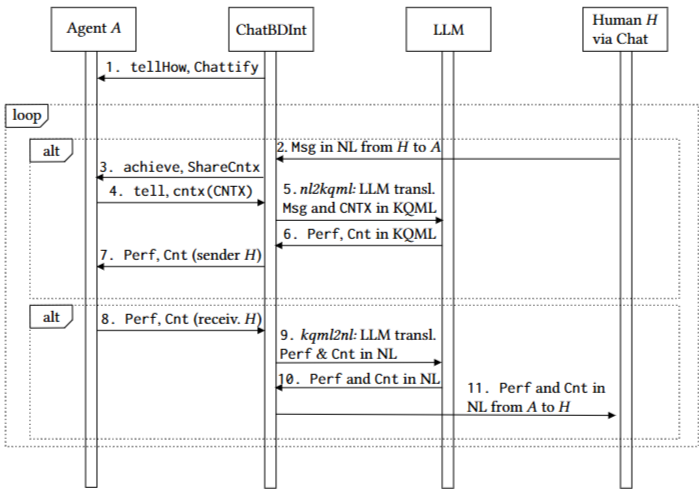
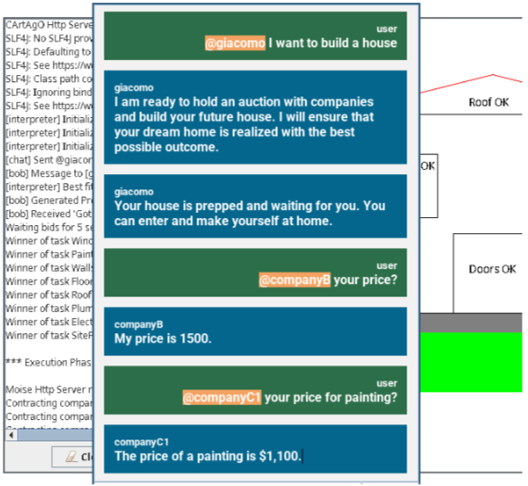

# ChatBDI: Think BDI, Talk LLM
본 논문에서는 LLM을 활용하여 인간과 통식하는 능력을 BDI 에이전트에 확장하는 프레임 워크인 ChatBDI에 대해 설명한다. BDI 에이전트와 LLM의 ChatBDI 통합은 인간과 에이전트 간의 중간 언어로서의 지식 쿼리 및 조작 언어(Knowledge Query and Manipulation Language, KQML)와 구현 언어로서 Ja-CaMo 프레임워ㅏ크 내부의 Jason에 의존한다.

ChatBDI의 목적은 완전히 새로운 'BDI Speakers'를 만드는 것 뿐만 아니라 기존 BDI 에이전트의 소스 코드를 변경하지 않고도 통신 기능을 추가하는 것이다. 이러한 Chattification은 두 가지 목적을 수행한다.

BDI 모델을 활용하여 LLM에 '의도적인 두뇌'를 제공함으로써 화자로서의 주요 제한 사항 중 하나인 의도성 부족을 해결한다. LLM의 생성 능력을 활용하여 BDI 에이전트에 창의적이고 유창한 '언어 작동기'를 추가한다.

---

# ChatBDI의 개발 및 사용

ChatBDI가 작동하려면 
1. 인간 사용자와의 상호 작용을 허용하는 사용자 인터페이스.
2. 에이전트가 생성한 KQML 메시지에서 인간 사용자와 공유할 자연어 문장으로서의 kqml2nl(Knowledge Query and Manipulation Language to Natural Language) 함수.
3. 인간이 에이전트에 의해 이해되도록 하기 위해 사용자의 자연어 문장에서의 nl2kqml 함수
4. 자연어와 KQML 언어 간, 따라서 인간과 BDI 에이전트 간의 통역자 역할을 하는 중간 BDI 에이전트가 필요하다.

ChatBDI 인터프리터 에이전트인 ChatBDInt는 nl2kqml 함수를 호출하여 KQML 메시지를 얻고, ChatBDInt 자체가 Jason 에이전트이므로 MAS(Multi-Agent System)에서 올바른 수신자에게 보낼 수 있다. 마찬가지로 ChatBDI는 MAS 에이전트로부터 KQML 메시지를 수신하고, 해당 메시지에 대해 kqml2nl 함수를 호출하여 문장을 결과로 얻고, 인간 사용자가 읽고 이해할 수 있도록 채팅 인터페이스에 표시할 수 있다.

## From KQML to Natural Language
kqml2nl을 구현하고 구조화된 메시지에서 유창한 문장을 생성하는 매우 자연스럽고 일관된 접근 방식은 LLM을 이용하는 것이다. kqml2nl 함수는 LLM에게 요청을 자세히 설명할 수 있는 수단과 번역할 KQML 메시지를 제공하는, 신중하게 설계되었지만 도메인에 독립적인 프롬프트를 제공한다. 반환 값은 LLM에 의해 생성된 문장이다.

## From Natural Language to KQNL
이 번역 방향은 훨씬 더 복잡하며 다양한 접근 방식을 사용하여 해결할 수 있다. 예를 들어, Rasa 및 Dialogflow와 같은 의도 기반 챗봇에서 사용할 수 있는 Natural Language Understanding(NLU) 블랙 박스 구성 요소와 ad hoc 훈련된 분류기가 그 목적에 부합할 수 있다.

ChatBDI 프로토타입에서 LLM은 임베딩 생성 단계 이후에 연속적으로 이 두 번째 문제를 해결하는 데에도 사용된다. nl2kqml 함수는 LLM이 먼저 사용자 문장의 발화 행위를 이해해야 한다. 그런 다음, 인식된 발화 행위를 기반으로 메시지 내용은 논리적 Atom으로 변환되어 KQML 메시지의 적절한 내용으로 사용된다. ChatBDInt에 의해 저장된 chattified 에이전트에 대한 현재 신념 및 기타 유용한 정보로 구성된 컨텍스트가 LLM에 대한 프롬프트에 추가된다. 컨텍스트는 하드 와이어링되지 않고 오히려 일반성을 위해 실행 시 MAS 에이전트에게 요청된다.

## From humans to agents, and back.
아래의 그림은 사람 H, ChatBDint, LLM 및 에이전트(A는 MAS의 모든 에이전트 중 하나를 나타낸다.) 간의 상호 작용을 간략하게 보여준다.

1. 먼저, ChatBDI는 컨텍스트를 제공하고 tellGow(메시지 1)를 통해 인식되지 않은 메시지를 처리하는 방법을 가르쳐 에이전트를 'chattify'한다.
2. 일단 chattify되면 에이전트와 사용자는 양방향으로 통신을 시작할 수 있다. 사용자 메시지는 처리되고(화살표 2), chattify된 에이전트가 제공할 수 있는 도메인에 대한 컨텍스트로 보강되며(화살표 3 및 4),
3. LLM에 의해 KQML로 번역된다(화살표 5 및 6).
4. KQML 메시지는 마치 사람 H에서 온 것처럼 의도된 수신자 A에게 전송된다.

반대로, 사람을 위한 에이전트 메시지(화살표 8)는 자연어로 변환되고(화살표 9 및 10), ChatBDInt에 의해 마치 A에서 온 것처럼 H에게 전송된다(화살표 11).

## Implementation
ChatBDI는 다양한 MAS에서 유연성과 적응성을 갖도록 설계되었다. 모듈성을 보장하기 이를 통해 핵심 프레임워크를 수정하지 않고도 kqml2nl 및 nl2kqml에 의해 구현된 번역을 원활하게 교체하여 MAS의 진화하는 특성을 수용할 수 있다.

## Example
https://github.com/jacamo-lang/jacamo/tree/main/examples/house-building
위 링크는 아래의 그림에서 제공되는 주택 건설 JaCaMo MAS를 chattify한 것이다. 집을 짓기 위한 요청을 받고 응답할 수 있도록 giacomo 코드에 두 개의 계획만 추가했다. ChatBDI 인터페이스를 통해 인간 사용자는 giacomo에게 집을 지어달라고 요청할 수 있다. 원래 JaCaMo 코드에 따라 giacomo는 경매를 시작하고, 경매는 성공적으로 완료되어 집이 지어진다. 인간 사용자는 건설 회사에 서비스 가격을 직접 문의할 수도 있다.

---

# Conclusions
ChatBDI의 chattification의 주요 이점은 사용자가 MAS에 들어갈 수 있도록 하는 것 외에도 MAS 검사 가능성이 향상된다는 것이다.